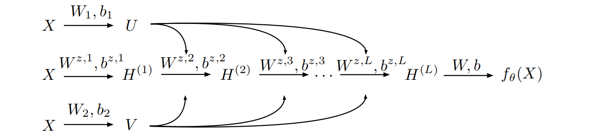

## 问题描述

三维Poisson方程
$$
\Delta u=-\sin (4 \pi x) \sin (4 \pi y) \sin (4 \pi z),  \, (x,y,z) \in \Omega \\
u = \frac{1}{3(4\pi)^2}\sin (4 \pi x) \sin (4 \pi y) \sin (4 \pi z),  \, (x,y,z) \in \partial\Omega
$$
其中 $\Omega$ 代表求解区域，我们求解了几种常用的几何边界：四面体、圆柱、圆锥。


## PINNs方法求解Poisson方程

PINNs方法的优化目标为：
$$
\min _\theta \mathcal{L}_{\text {train }}(\theta)=\lambda_r \mathcal{L}_r(\theta)+\lambda_{b c} \mathcal{L}_{b c}(\theta),
$$
其中， $\mathcal{L}_r$ 和 $\mathcal{L}_{bc}$ 分别代表内部残差和边界损失值。$\lambda=\left\{\lambda_r, \lambda_{b c} \right\}$ 是损失函数的权重，能够均衡收敛不同损失项的收敛速度。

其中 $\mathcal{L}_r$ 和 $\mathcal{L}_{bc}$ 可分别表示为：
$$
\mathcal{L}_r(\theta)=\frac{1}{N_r} \sum_{i=1}^{N_r}\left|\mathcal{N}\left[u_{\mathcal{N} \mathcal{N}_\theta}\right]\left(x_r^i\right)-f\left(x_r^i\right)\right|^2\\ \mathcal{L}_{b c}(\theta)=\frac{1}{N_{b c}} \sum_{i=1}^{N_{b c}}\left|\mathcal{B}\left[u_{\mathcal{N} \mathcal{N}_\theta}\right]\left(x_{b c}^i\right)-g\left(x_{b c}^i\right)\right|^2
$$
这里的 $\mathcal{N}[\cdot]$ 和 $\mathcal{B}[\cdot]$ 分别是控制方程的微分算子和边界条件。


## 模型结构

我们采用了Modified MLP网络结构：
$$
\begin{aligned}
&U=\phi\left(X W^1+b^1\right), \quad V=\phi\left(X W^2+b^2\right) \\
&H^{(1)}=\phi\left(X W^{z, 1}+b^{z, 1}\right) \\
&Z^{(k)}=\phi\left(H^{(k)} W^{z, k}+b^{z, k}\right), \quad k=1, \ldots, L \\
&H^{(k+1)}=\left(1-Z^{(k)}\right) \odot U+Z^{(k)} \odot V, k=1, \ldots, L \\
&f_\theta(x)=H^{(L+1)} W+b
\end{aligned}
$$
Modified MLP模型结构图如下：




该模型结构参考了文章（Sifan Wang, Yujun Teng, and Paris Perdikaris. Understanding and mitigating gradient pathologies in physics-informed neural networks），比起全连接能够更加容易地抓取PDE解中带有剧烈变化的部分。


## 数据集

PINNs方法可以根据物理信息无监督地学习PDE方程，数据集是通过采样得到的。在本算法中，我们的训练数据和测试数据都是根据物理区域直接生成的，具体方式为：对于二维几何建模采样方法，我们采用矩形框住目标多边形区域，在矩形框内等距采样，然后依靠判断条件获取对应几何区域内部的采样点；对于目标多边形的边界，我们计算出直线的方程，在每一条边上都进行等距采样(对于圆形边界，我们在$[0,2\pi]$上对角度进行等距采样后通过变换得到边界点)。


## 运行环境要求

计算硬件：Ascend 计算芯片

计算框架：Mindspore 1.7.0，numpy 1.21.2，matplotlib 3.5.1，scipy 1.5.4


## 代码框架

```
.
└─PINNforPoisson
  ├─README.md
  ├─src
    ├──config.py                      # parameter configuration
    ├──dataset.py                     # dataset
    ├──model.py                       # network structure
    ├──eager_lbfgs.py                 # L-BFGS algorithm
  ├──solve.py                         # train and test
```


## 模型训练

可以直接使用solve.py文件进行PINNs模型训练和求解Poisson方程。在训练过程中，模型的参数和训练过程也会被自动保存

```
python solve.py
```


## MindScience官网

可以访问官网以获取更多信息：https://gitee.com/mindspore/mindscience